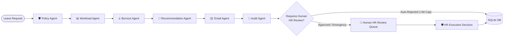

<div align="center">

# ⚡ HR Flow AI (HR Motion)
### Autonomous Multi-Agent Workforce & Leave Governance System

[](https://langchain-ai.github.io/langgraphjs/)
[](https://ai.google.dev/)
[](https://react.dev/)
[](https://expressjs.com/)
[](https://github.com/features/actions)
[](https://vercel.com/)

<p align="center">
  <b>A state-of-the-art multi-agent AI platform combining policy document compliance, real-time workload modeling, burnout radar, team PTO calendar collision detection, and Human-in-the-Loop HR governance.</b>
</p>

[Explore Features](#-key-features) • [Agent Architecture](#-multi-agent-architecture) • [Quick Start](#-getting-started) • [Team Calendar](#-team-availability-calendar) • [Deployment](#-cloud-deployment--cicd)

---

</div>

## 📌 Executive Summary

Traditional HR leave management systems are manual, static, and disconnected from team capacity. Critical project deadlines are jeopardized when multiple engineers take off simultaneously, and employees quietly burn out without early intervention.

**HR Flow AI** revolutionizes workforce governance through an autonomous **LangGraph multi-agent pipeline**:
1. Evaluates leave requests against **attached corporate policy documents** (e.g. 3-day caps with emergency exception clauses).
2. Dynamically calculates **team workload disruption** and **employee burnout risk**.
3. Detects **scheduling collisions** before approvals.
4. Synthesizes an AI recommendation while enforcing **Human-in-the-Loop (HITL)** governance for binding HR managerial decisions.

---

## 🌟 Key Features

### 1. 🤖 6-Node Autonomous LangGraph Multi-Agent Engine
* **🛡️ Policy Agent**: Cross-checks leave requests against dynamic policy documents, verifying duration caps and emergency exceptions.
* **📊 Workload Agent**: Calculates team bandwidth disruption and project delivery velocity impact.
* **🔥 Burnout Agent**: Analyzes historical fatigue, overtime velocity, and PTO deprivation index.
* **🧠 Recommendation Agent**: Synthesizes agent criteria into an actionable decision matrix.
* **✉️ Email Agent**: Drafts customized employee notices and managerial digest routing.
* **📑 Audit Agent**: Writes immutable audit trail logs into the SQLite database.

### 2. 📅 Team Availability Calendar & Overlap Radar
* **Month Grid View**: Responsive 7-day calendar with department color-coded leave chips (Engineering 🔵, Product 🟣, Data Science 🔷, People Ops 🟢, Sales 🟠, Design 🌸, Emergency 🚨).
* **Weekly Gantt Timeline**: Continuous horizontal timeline spanning team rosters across 7-day sprints.
* **Capacity Heatmap Radar**: Real-time department availability meters and automated AI coverage tips.
* **⚠️ AI Collision Detector**: Automatically flags dates when 2+ colleagues from the same department are out simultaneously, calculating exact capacity loss percentages.

### 3. 🛡️ Human-in-the-Loop (HITL) HR Governance Hub
* **HR Approvals Queue**: Dedicated queue for requests requiring human manager intervention (approvals, overrides, and emergency policy exceptions).
* **Manager Decision Notes**: Direct recording of managerial reasoning, reviewer identity, and audit logging.

### 4. 👥 Dual-Portal Role Experience
* **🏢 HR Executive Management Portal**: Executive workforce metrics, collision alerts, policy document editor, employee capacity roster, and audit trails.
* **👤 Employee Self-Service Portal**: Instant leave submission, live AI policy checking, team calendar, and personal workload health monitor.

---

## 🏗️ Multi-Agent Architecture



---

## 💻 Tech Stack

| Domain | Technologies |
| :--- | :--- |
| **Frontend** | React 19, Vite 8, Vanilla CSS (Dark Glassmorphism Design System), Axios, React Icons |
| **Backend** | Node.js (ESM), Express 5, LangGraph.js, SQLite3, JWT Authentication, Bcrypt.js |
| **AI / LLM** | Google Gemini 2.0 Flash (`@google/genai`), LangChain Core, LangChain Groq |
| **Security** | Rate Limiting, Helmet Headers, XSS Sanitization, CORS Protection, Parameterized SQL |
| **DevOps & CI/CD** | GitHub Actions, Vercel (Frontend SPA), Render (Backend Web Service) |

---

## 🚀 Getting Started

### 1. Prerequisites
* **Node.js**: v20.x or v22.x LTS
* **npm**: v10+

### 2. Clone the Repository
```bash
git clone https://github.com/YOUR_USERNAME/hr-flow-ai.git
cd hr-flow-ai
```

### 3. Install Dependencies
```bash
npm install
npm --prefix backend install
npm --prefix frontend install
```

### 4. Configure Environment Variables

**Backend (`backend/.env`):**
```env
PORT=5000
NODE_ENV=development
JWT_SECRET=super_secret_jwt_key_2026
GEMINI_API_KEY=your_gemini_api_key_here
# GROQ_API_KEY=your_groq_api_key_here (Optional)
```

**Frontend (`frontend/.env`):**
```env
VITE_API_URL=http://localhost:5000/api
```

### 5. Run the Application

```bash
# Terminal 1 - Backend Server (Port 5000):
npm run start:backend

# Terminal 2 - Frontend Dev Server (Port 5173):
npm run dev:frontend
```

👉 Open **`http://localhost:5173/`** in your browser.

---

## 🔑 Demo Login Credentials

The database comes pre-seeded with sample employees and credentials:

| Role | Email | Password | Access Privileges |
| :--- | :--- | :--- | :--- |
| **🏢 HR Executive Admin** | `admin@hrmotion.ai` | `admin123` | Full HR Governance, Approvals Queue, Collision Radar, Heatmap, Policy Editor |
| **👤 Employee Lead** | `alex.rivera@hrmotion.ai` | `admin123` | Self-Service Leave Application, Team Schedule, Personal Workload Radar |

*(You can also click the **"Demo Account Fast-Fill"** buttons directly on the login screen).*

---

## 📡 API Reference

### AI Workflow & Policy Endpoints
| Method | Endpoint | Description |
| :--- | :--- | :--- |
| `POST` | `/api/leave` | Executes the 6-agent LangGraph workflow on a leave request. |
| `GET` | `/api/policy` | Retrieves the active attached manual policy document. |
| `POST` | `/api/policy` | Updates company policy rules and maximum standard days. |

### Calendar & Workforce Intelligence
| Method | Endpoint | Description |
| :--- | :--- | :--- |
| `GET` | `/api/calendar/events` | Retrieves all scheduled PTO events, department coverage %, and overlap collisions. |
| `GET` | `/api/employees` | Retrieves employee directory with workload scores and burnout risk tags. |
| `POST` | `/api/employees` | Adds a new team member to the organization roster. |
| `GET` | `/api/analytics` | Overview metrics for executive workforce dashboard. |

### Governance & Approvals
| Method | Endpoint | Description |
| :--- | :--- | :--- |
| `GET` | `/api/leave/pending-hr` | Fetches leave requests awaiting Human HR decision. |
| `POST` | `/api/leave/hr-decision` | Submits binding Human HR Manager decision (Approved/Rejected with notes). |
| `GET` | `/api/leave/history` | Historical log of all processed leave requests. |

---

## ☁️ Cloud Deployment & CI/CD

### 🔄 CI/CD Automation with GitHub Actions
* **Continuous Integration (`.github/workflows/ci.yml`)**: Automated backend integration test suite and frontend production bundle compilation on every push and PR.
* **Continuous Deployment (`.github/workflows/deploy.yml`)**: Automatic trigger of Render deploy hook (backend) and Vercel CLI deployment (frontend) on merge to `main`.

### 🌐 Cloud Deployment Architecture
* **Frontend**: Deployed on [Vercel](https://vercel.com/) with SPA routing rewrites configured via `frontend/vercel.json`.
* **Backend**: Deployed on [Render](https://render.com/) with native Node runtime and zero-downtime deploy hooks configured via `render.yaml`.

---

## 🧪 Testing Locally

```bash
# Run Backend Integration & DB Tests
npm --prefix backend test

# Run Frontend Production Build Validation
npm --prefix frontend run build
```

---

## 📄 License

This project is licensed under the **MIT License** — feel free to use and extend it for hackathons, research, and enterprise workforce governance.
